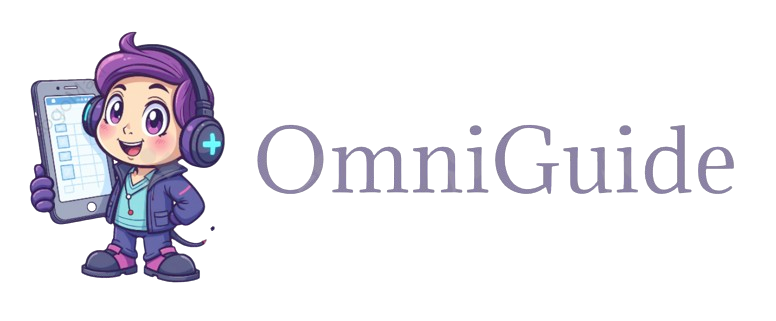

# OmniGuide — Voice + Screen Agent for Calendar Assistance



A LiveKit-based multimodal agent that understands your shared screen, chats by voice or text. It captures screen-share frames, injects them into an LLM turn for grounded reasoning, and exposes tools to list free time slots and book meetings.

---

## Badges
- **Build**: passing
- **License**: MIT
- **Python**: 3.11+
- **Coverage**: n/a

---

## Features
- **Voice and chat**: Uses OpenAI LLM and optional Deepgram/OpenAI TTS for natural interactions.
- **Screen-aware guidance**: Automatically attaches the latest screen-share frame to user turns for grounded Q&A.
- **Calendar tools**: `GoogleCalendar`: reads free/busy and creates events via Google Calendar API.
- **LiveKit integration**: Works with the LiveKit Playground; subscribes to screen-share tracks and captures frames.

---

## Installation

### Prerequisites
- Python 3.11+
- A LiveKit Cloud project or self-hosted LiveKit with Playground access

### Setup
```bash
cd examples/omniguide
python -m venv .venv
source .venv/bin/activate
pip install -r requirements.txt
cp template.env .env  # then edit with your keys
```

---

### Usage: Screen Q&A + Google Calendar (run `run_app.py`)
- Injects the latest screen frame into the LLM turn and offers:
  - `list_available_slots(range)` to list free time
  - `schedule_appointment(date_time)` to book a meeting
```bash
cd examples/omniguide
python run_app.py
```

In the LiveKit Playground:
1. Create/join a room and connect the worker.
2. Enable microphone, chat, and screen share.
3. Share a calendar window or any UI and ask questions by voice or text.
4. Example utterances:
   - “What’s you see on my screen”
   - “Book a 60-minute slot next Friday at 14:30.”
   - “List a few options in the next two weeks.”

Playground tips:
- Enable mic, chat, and screen share.
- The agent will proactively offer to check availability.

---

## Configuration / Environment Variables

Use `.env` based on `template.env`:

```
# LiveKit
LIVEKIT_URL=wss://<your-livekit-host>
LIVEKIT_API_KEY=
LIVEKIT_API_SECRET=

# OpenAI (LLM, TTS, Realtime)
OPENAI_API_KEY=

# Deepgram (optional TTS in run_app)
DEEPGRAM_API_KEY=

# Google Calendar (for run_app GoogleCalendar flow)
GOOGLE_CAL_BASE_URL=https://www.googleapis.com/calendar/v3/
GOOGLE_CAL_ACCESS_TOKEN=<OAuth2 access token>

# Cal.com (optional; used by omniguide_agent.py)
CAL_API_KEY=
```

Notes:
- `GOOGLE_CAL_ACCESS_TOKEN` must be a valid OAuth2 token authorized for the target calendar.

---

## Contributing
- Fork and open a PR with a clear description.
- Keep code readable and typed; prefer descriptive names and early returns.
- Include minimal repro steps for bug reports.
- Follow semantic commit messages where possible.

---

## License
MIT

---

## Acknowledgements
- **LiveKit Agents SDK** for real-time audio/video and room orchestration.
- **OpenAI** for LLM and TTS models.
- **Deepgram** for STT/TTS (optional path).
- **Google Calendar API** for scheduling integrations.

